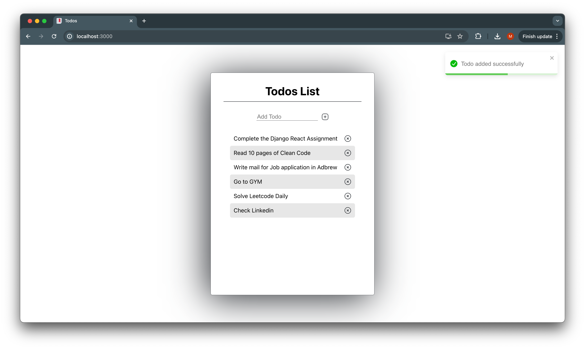

# Soltuion To - adb_test

Hii, Moin here, this is my solution to the Django + React + Docker Test.
Also along with Fetch all todos, and add todos, I have also added delete todo.

Screenshot on Solution and find the attached solution recording.

# Docker and Setup Fixes
1. Change in Dockerfile to fix the Download of Mongo to build the image. Remove the existing wget command and replaced with the curl command given in the Officail Documentation of MongoDB
2. Issue with pip install -> removed pandas from requirements as it was not being used
3. Issue with yarn install -> replaced the React and other libs version to the latest

Also I think rather than having same Dockerfile for both React and Django application, It would have been better if two different Dockerfiles were used. One with python as base image to build the Django container and one with nodejs to build the react container.

For `Backend(Django)` APIs
1. GET /todos -> to fetch all todos.
2. POST /todos/ -> to create one.
3. DELETE /todos/{id} -> to delete todo with given id.

For `Frontend(React)`
1. Used the React 18 -> changed the root render method.
2. Created a Home.js Component
3. Create Todo along with validation.
4. Also Delete Todo.
5. Added Toast Messages.